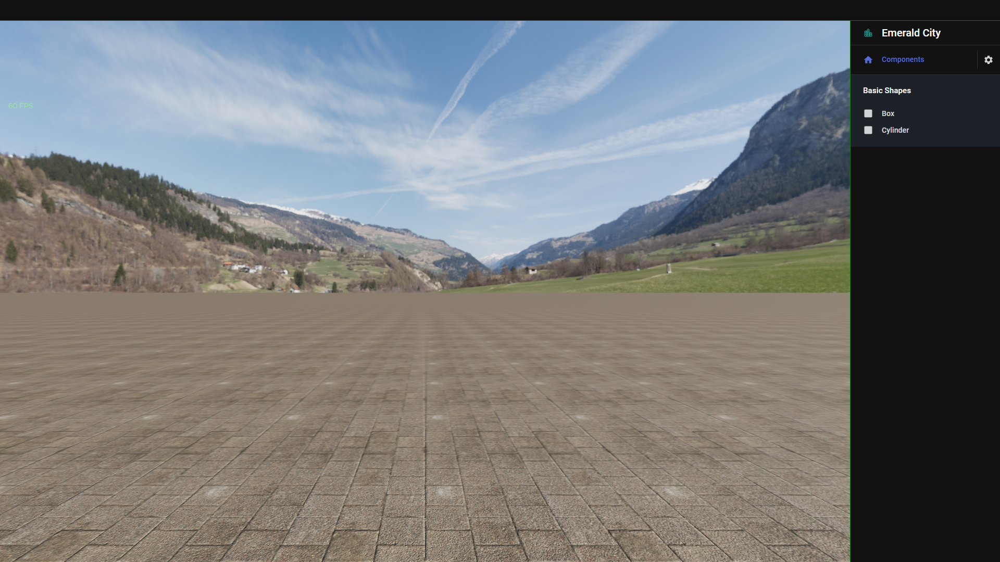

# emerald-city

## Overview

- TODO

<picture>
  <source media="(prefers-color-scheme: dark)" srcset="./assets/landing-image.png">
  <source media="(prefers-color-scheme: light)" srcset="./assets/landing-image.png">
  
</picture>

## GETTING STARTED

- TODO

## USAGE

- TODO

## To Focus

- [x] Performance (90+ FPS).
- [x] Ultra-Realistic Experience (Rendering + Spatial Sound).
- [x] Scalability (Large number of users, and objects in scene).
- [x] Complete decoupling of UI and Core Engine.
- [x] Huge Feature Sets.
- [x] Code Quality.
- [x] Ecommerce Focused
- [x] Some Flipkart/
- [x] Walmart Specific Ideas/Features
- [x] No reliance on HTML DOM in play mode.

## Todo

### Frontend

- [x] Initial Frontend Setup.
- [x] Editor Camera Controller.
- [x] UI Setup
- [x] Add Scene Graph
- [x] Add world Outliner.
- [x] Unlock Full FPS.
- [x] Add transform controls, in Editor Scene.
- [x] Add Screen Picker (CPU).
- [ ] Add Screen Picker (GPU).
- [ ] Addd drag and drop object support in editor.
- [ ] Add scene(object transforms) backup with backend.
- [ ] Add lots of basic shapes.
- [ ] Add the required lights.
- [ ] Add .gltf, .glb import support.
- [ ] Add .fbx import support.
- [ ] Add .obj import support.
- [ ] Add file drag and drop import support.
- [ ] Add texture import support.
- [ ] Add custom material creation support.
- [ ] Add shadow rendering support.
- [ ] Add volumetric lighting options.
- [ ] Add decals for better realisim.
- [ ] Add Play Test Support, with a play button in toolbar.
- [ ] Add Initial Physics Engine Setup.
- [ ] Add Avatar creation support
- [ ] Add Character animations and other animation support.
- [ ] Add Animation Blending.
- [ ] FPS Camera Controller.
- [ ] Improve Camera Controllers with spring arm.
- [ ] Add landscape generation workflow.
- [ ] Add 3D world interaction, eg. object try-ons.
- [ ] Shopping/Add to cart, flipkart/ecommerce style.
- [ ] Add scalable UI size.
- [ ] Add Global Texture Quality Manager.
- [ ] Add Scalable Graphics Settings.
- [ ] Remove IBL programitically, or only keep IBL for certain objects.
- [ ] Create a initial scene with gold shop and a garden.
- [ ] Another amusement park with vibrant colors and foot stepping music.
- [ ] A cinema hall with video playing on wall and spatial sound.
- [ ] Emojis/guesture of characters
- [ ] Test the engine for realisim and playabilty.
- [ ] Add Sound(Spatial Audio) Engine Setup.
- [ ] Add chat support with Websockets.
- [ ] Add Networking with Websockets
- [ ] Migrate all networking to WebRTC.
- [ ] Add Voice Chat.
- [ ] Add VR support.
- [ ] Add AR support.
- [ ] Add environment variable support, for debug-only logging.

### Backend

- [x] Initial Backend Setup.
- [ ] Setup AWS EC2 with load balancers, ssl.
- [ ] Implement CI/CD with docker and github actions.
- [ ] Implement Reverse proxy for servers using nginx.
- [ ] Implement Websocket.
- [ ] Implement WebRTC.
- [ ] Implement Voice & Video Api Chat API.
- [ ] Implement Websocket Chat API.
- [ ] Design Metaverse Info Storage schemas(LLD).
- [ ] Add Database Layer.
- [ ] Add AWS S3 storage of textures and 3D models.
- [ ] Create buffered high-speed retrieval (signed url) from AWS S3.
- [ ] Add ability to save metaverse spaces, and publishing support.
- [ ] Automatic 3D point cloud generation, and object creation using backend AI.
- [ ] Add CloudFront caching.
- [ ] Add blockchain storage.
- [ ] Add custom in-game cryptocurrency.
- [ ] Add NFT purchase options.
- [ ] Add ml based face mimicking of avatar(Last).
- [ ] Create Game State Synchronization mechanism and API in backend.
- [ ] Implement Redis Store for Game State Storage.

## SUPPORTED PLATFORMS

- [x] Web
- [ ] Windows (Electron) [Todo]
- [ ] Linux (Electron) [Todo]
- [ ] MacOS (Electron) [Todo]
- [ ] Android (React Native) [Todo]
- [ ] iOS (React Native) [Todo]

## LICENCE

GNU Affero General Public License 3.0 (AGPL-3.0-only)

**For licensing contact the code owners.**

## Code Owners

- Saikat Dey [Team Lead] (notfathomless) digonto.pvt.2021@gmail.com https://github.com/notfathomless
- Sayantan Pal (sayantan135) sayantanpal2002@gmail.com https://github.com/sayantan135
- Sudip Ghosh sudip.leo07@gmail.com https://github.com/SUDIP1969

## Team Name

- **Crystal Grid**
